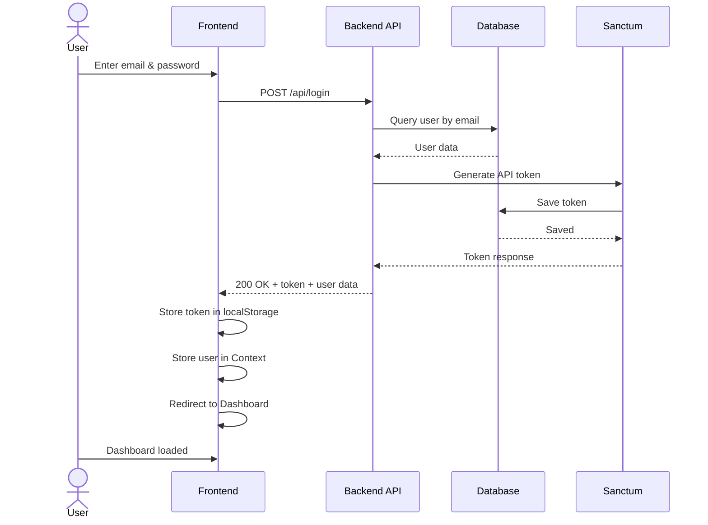
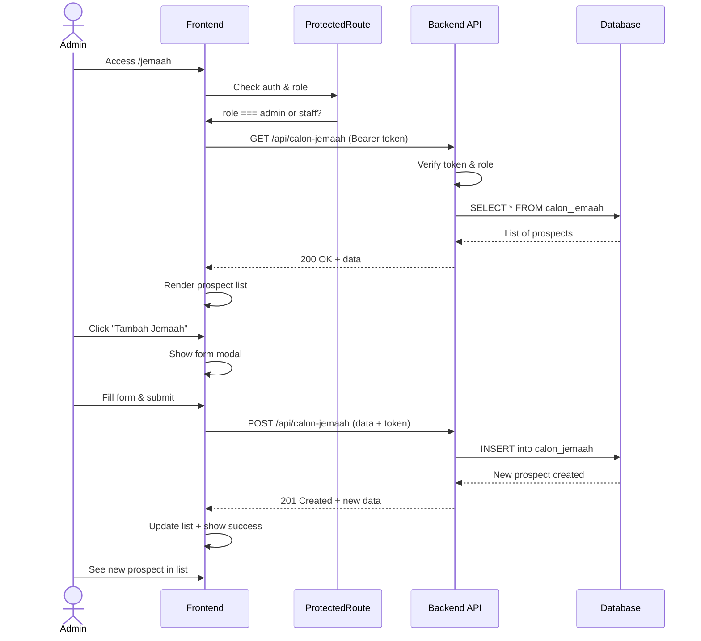
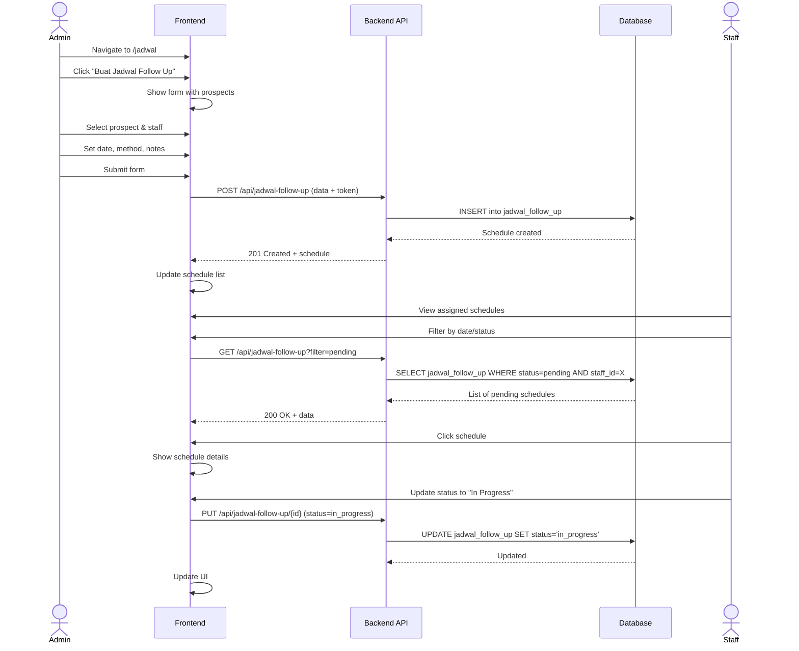
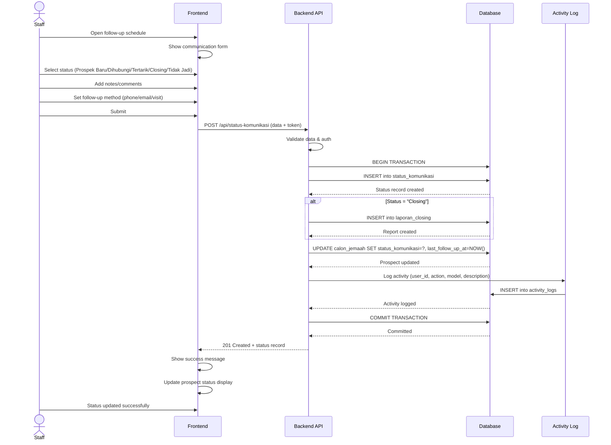
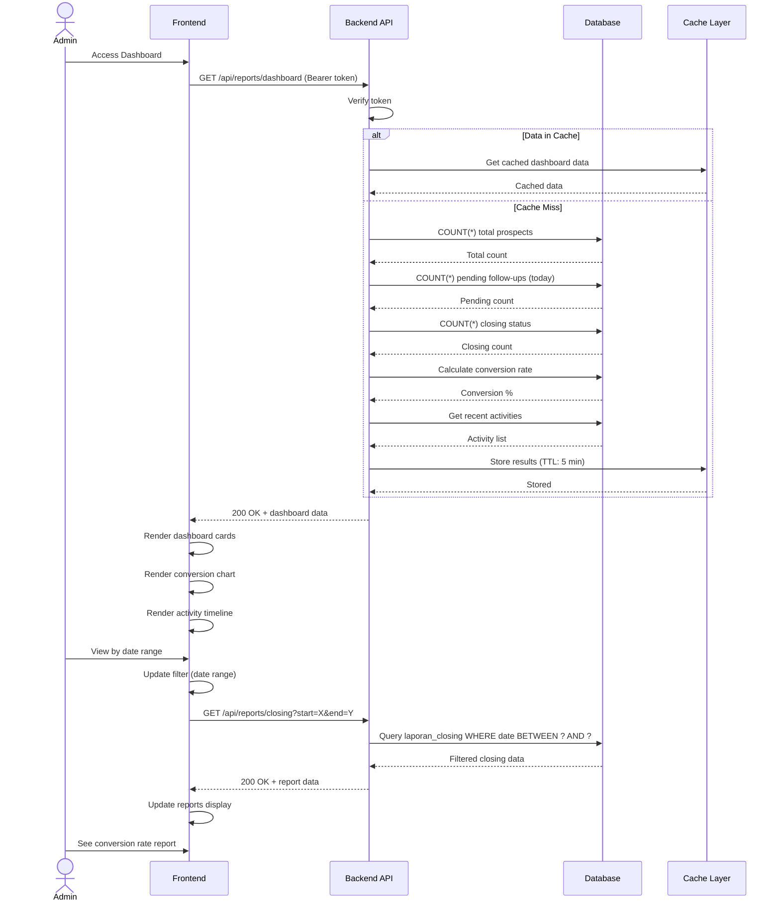
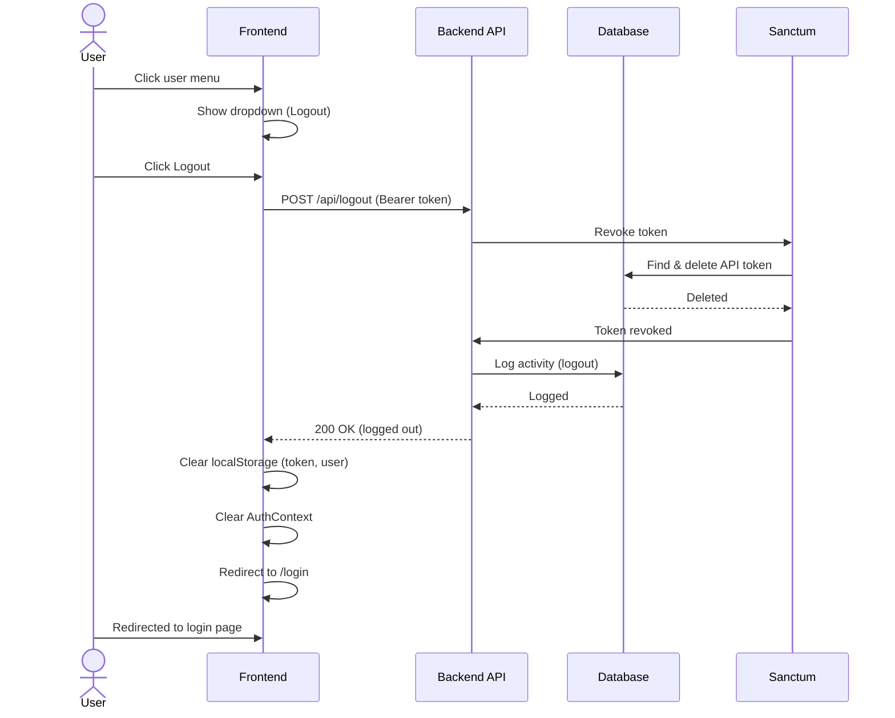
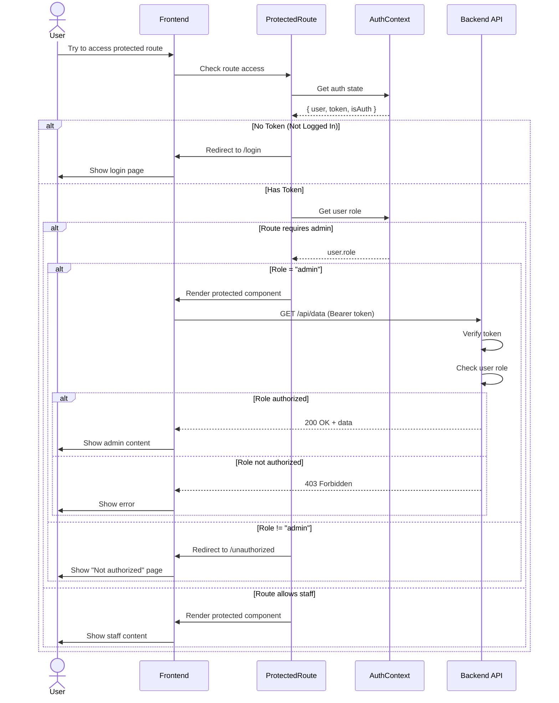

# Sequence Diagrams - Jemaah Follow Up Management System

Dokumen ini berisi semua kode Mermaid untuk sequence diagrams sistem.

---

## 1. Authentication Flow - Login

**Deskripsi:** Menunjukkan alur login dari user input hingga token tersimpan dan redirect ke dashboard



---

## 2. Prospect Management Flow

**Deskripsi:** Menunjukkan alur CRUD operasi untuk manajemen data calon jemaah



---

## 3. Follow-up Scheduling Flow

**Deskripsi:** Menunjukkan alur pembuatan jadwal follow-up oleh admin dan akses oleh staff



---

## 4. Communication Status Update Flow

**Deskripsi:** Menunjukkan alur update status komunikasi dengan transaction handling dan activity logging



---

## 5. Dashboard & Reporting Flow

**Deskripsi:** Menunjukkan alur dashboard dengan caching strategy untuk performa optimal



---

## 6. Logout Flow

**Deskripsi:** Menunjukkan alur logout dengan token revocation dan cache clearing



---

## 7. Role-Based Access Control Flow

**Deskripsi:** Menunjukkan alur validasi akses berdasarkan role dari frontend hingga backend



---

## Catatan Penggunaan

### Cara Menggunakan Kode Mermaid:

1. **Di Markdown File:**
   ```markdown
   ```mermaid
   [PASTE KODE MERMAID DI SINI]
   ```
   ```

2. **Di GitHub:**
   - Langsung paste kode dalam code block dengan ` ```mermaid `
   - GitHub akan otomatis merender diagram

3. **Di Dokumentasi Online:**
   - Gunakan [Mermaid Live Editor](https://mermaid.live)
   - Copy-paste kode dan klik "Copy as Markdown"

4. **Di Aplikasi lain:**
   - Notion: Paste ke code block dengan language "mermaid"
   - Confluence: Gunakan Mermaid diagram macro
   - VS Code: Install extension "Markdown Preview Mermaid Support"

---

## Ringkasan Diagram:

| No | Nama | Deskripsi | Actors |
|----|------|-----------|--------|
| 1 | Authentication Flow | Login & token generation | User, Frontend, Backend, Sanctum |
| 2 | Prospect Management | CRUD for calon jemaah | Admin, Frontend, Backend, DB |
| 3 | Follow-up Scheduling | Create & track schedules | Admin, Staff, Frontend, Backend |
| 4 | Status Communication | Update komunikasi & logging | Staff, Frontend, Backend, DB, Logger |
| 5 | Dashboard & Reporting | Analytics dengan caching | Admin, Frontend, Backend, Cache |
| 6 | Logout | Token revocation & cleanup | User, Frontend, Backend, Sanctum |
| 7 | RBAC | Role-based access control | User, Frontend, ProtectedRoute, Backend |

---

*Generated: April 18, 2026*