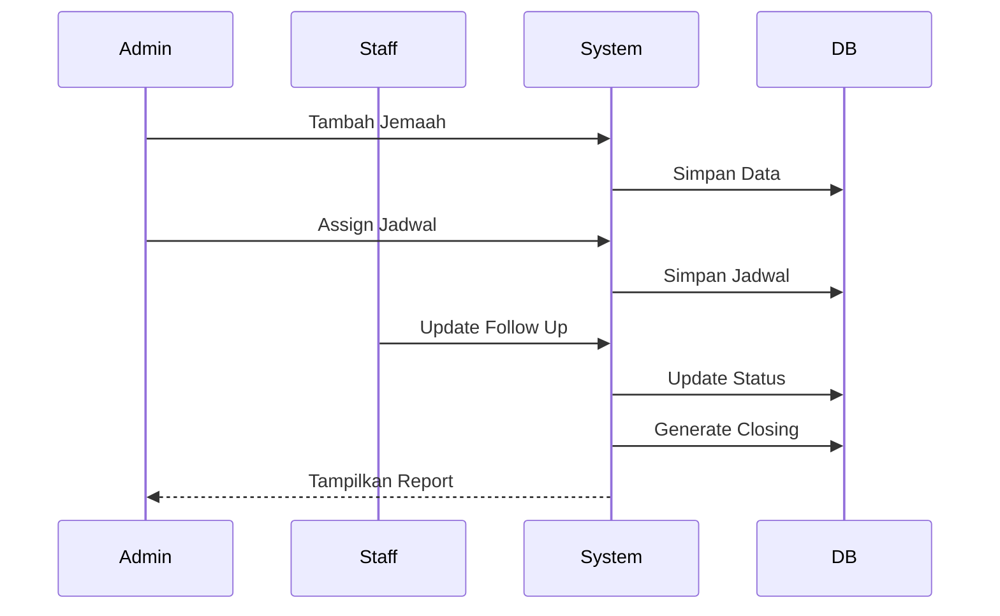

# PRD — Project Requirements Document

## Jemaah Follow Up Management System

---

## 1. Overview

**Jemaah Follow Up Management System** adalah aplikasi berbasis web yang berfungsi sebagai sistem CRM (Customer Relationship Management) untuk bisnis travel umroh/haji.

Aplikasi ini dirancang untuk membantu tim marketing dalam mengelola calon jemaah, menjadwalkan follow up, mencatat hasil komunikasi, serta memonitor performa closing secara terstruktur dan terukur.

### Problem Statement

Permasalahan utama yang ingin diselesaikan:

* Data calon jemaah tersebar dan tidak terorganisir
* Tidak ada tracking follow up yang jelas
* Sulit memonitor progres komunikasi
* Tidak ada sistem evaluasi performa marketing

### Goals

* Centralized data calon jemaah
* Sistem follow up terjadwal
* Tracking komunikasi yang jelas
* Monitoring conversion & closing

---

## 2. Requirements

### Functional Requirements

* Sistem memiliki 2 role utama: **Admin dan Staff**
* Admin dapat mengelola seluruh data dan aktivitas
* Staff hanya dapat mengakses data yang ditugaskan
* Sistem mampu mencatat:

  * Jadwal follow up
  * Status komunikasi
  * Aktivitas user
* Sistem menghasilkan laporan closing & conversion rate

### Non-Functional Requirements

* Web-based application (desktop-first)
* Responsive UI (minimal tablet support)
* Data persistence menggunakan database relasional
* Clean & modern UI (sesuai design Figma)

---

## 3. User Roles

### 👑 Admin

Tanggung jawab:

* Mengelola data calon jemaah
* Membuat & assign jadwal follow up
* Melihat seluruh aktivitas sistem
* Mengelola user (staff)
* Melihat laporan closing

### 👨‍💼 Staff (Marketing)

Tanggung jawab:

* Melihat jemaah yang ditugaskan
* Melakukan follow up
* Update hasil komunikasi
* Update status jemaah
* Melihat histori aktivitas pribadi

---

## 4. Core Features

### 4.1 Dashboard

* Statistik total jemaah
* Follow up hari ini
* Total closing
* Conversion rate
* Grafik aktivitas

---

### 4.2 Data Calon Jemaah

* List jemaah
* Search & filter
* Tambah jemaah
* Import data (opsional MVP+)

---

### 4.3 Jadwal Follow Up

* List jadwal
* Filter berdasarkan:

  * Status
  * Staff
  * Metode
* Create jadwal follow up
* Update status

#### Status Jadwal:

* Pending (kuning)
* In Progress (biru)
* Done (hijau)

---

### 4.4 Status Komunikasi

Tracking hasil komunikasi dengan jemaah

#### Status:

* Prospek Baru (ungu)
* Dihubungi (biru)
* Tertarik (kuning)
* Closing (hijau)
* Tidak Jadi (merah)

---

### 4.5 Laporan Closing

* Total closing
* Filter periode waktu
* Conversion rate
* Insight performa marketing

---

### 4.6 Activity Log

* Log aktivitas user
* History follow up
* Audit trail

---

## 5. User Flow

### Flow Utama Sistem:

1. Admin menambahkan data jemaah
2. Admin membuat jadwal follow up
3. Jadwal di-assign ke staff
4. Staff melakukan follow up
5. Staff update:

   * Status jadwal
   * Status komunikasi
6. Jika status = Closing → masuk laporan
7. Semua aktivitas tercatat di log

---

## 6. System Logic

### Perbedaan Konsep Utama

| Komponen          | Fungsi          |
| ----------------- | --------------- |
| Jadwal Follow Up  | Task / proses   |
| Status Komunikasi | Hasil / outcome |

---

### Simplifikasi Status

#### Jadwal:

* Pending
* In Progress
* Done

#### Komunikasi:

* Prospek Baru
* Dihubungi
* Tertarik
* Closing
* Tidak Jadi

---

## 7. Database Schema (High-Level)

### Entitas Utama:

* Users
* CalonJemaah
* JadwalFollowUp
* StatusKomunikasi
* LaporanClosing
* ActivityLog

---

### Relasi:

* User (Admin/Staff) → manage data
* Jemaah → memiliki banyak jadwal
* Jadwal → menghasilkan status komunikasi
* Status → mempengaruhi laporan closing

---

### Contoh Struktur Tabel

#### users

* id
* name
* email
* password
* role (admin/staff)

#### calon_jemaah

* id
* nama
* kontak
* alamat
* sumber
* created_at

#### jadwal_follow_up

* id
* jemaah_id
* staff_id
* tanggal
* metode
* status

#### status_komunikasi

* id
* jadwal_id
* status
* catatan

#### laporan_closing

* id
* jemaah_id
* tanggal_closing
* nilai (opsional)

#### activity_logs

* id
* user_id
* aktivitas
* timestamp

---

## 8. Architecture

### Tech Stack

* Backend: Laravel
* Database: MySQL
* Frontend: Blade / API-based (opsional Vue/React)
* Deployment: Railway

---

### Flow Sistem (Simplified)

---

## 9. Design Guidelines

### Theme

* Primary: Teal (#1F6B74)
* Accent: Cream (#F8E0D4)

### UI Style

* Clean & modern
* Islami tone
* Card-based layout
* Rounded corner + soft shadow

---

### Layout

* Sidebar (navigation)
* Topbar (search + profile)
* Content (cards & tables)

---

### Components

* Dashboard cards
* Tables (data)
* Status badges (color-coded)
* Modal forms
* Primary button (teal)

---

## 10. Constraints & Considerations

* Sistem harus sederhana (MVP mindset)
* Tidak over-engineered
* Fokus pada usability marketing team
* Data harus mudah dibaca & diupdate
* Performa cukup untuk skala kecil–menengah

---

## 11. Current Project Status

* ✅ UI/UX hampir selesai
* ✅ Flow sistem jelas
* ✅ ERD & DFD tersedia
* ✅ Class diagram lengkap
* ✅ Logic sistem matang
* ⚙️ Backend development: in progress

---

## 12. Future Improvements

* Notifikasi WhatsApp otomatis
* Reminder follow up
* Integration dengan payment system
* Export laporan (PDF/Excel)
* Role tambahan (Supervisor)

---

## 13. Conclusion

Aplikasi ini merupakan CRM sederhana yang fokus pada:

* Manajemen prospek jemaah
* Penjadwalan follow up
* Tracking komunikasi
* Monitoring closing

Dengan pembagian peran yang jelas:

* Admin → kontrol & manajemen
* Staff → eksekusi & follow up

Sistem ini dirancang untuk meningkatkan efektivitas tim marketing dan meningkatkan conversion rate secara signifikan.

---
